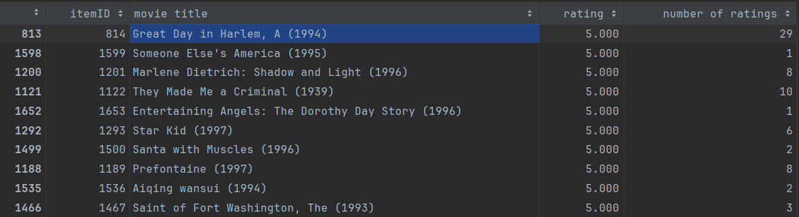
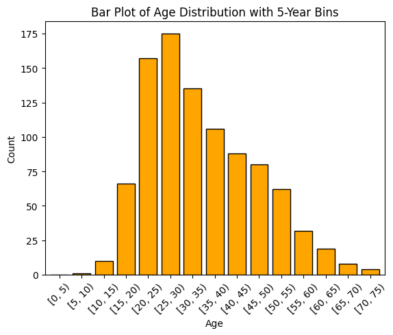
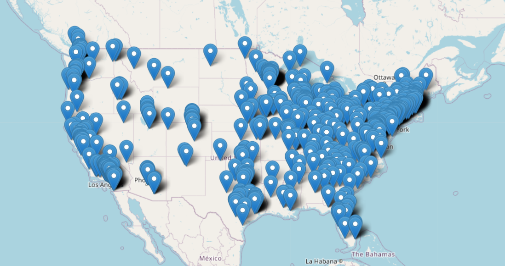
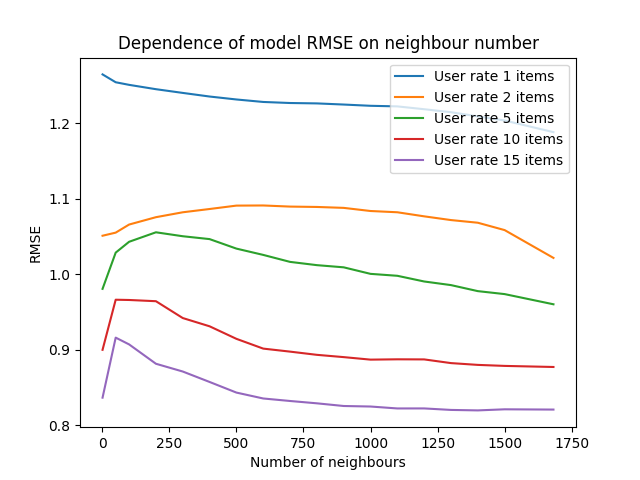

# Introduction

Here, I implement an item-to-item collaborative filtering recommendation system based on centered cosine similarity (Pearson correlation). 
Also, baseline estimate used for improving model prediction quality. 
Collaborative filtering is a popular technique for making personalized recommendations by leveraging user-item interactions.
The code implements a recommendation model using Nearest Neighbors with cosine similarity and incorporates a baseline estimation approach to predict user-item ratings.

# Data Description

I will use [MovieLens 100K dataset](https://grouplens.org/datasets/movielens/100k/) consisting user ratings to movies.

**General information about the dataset:**
* It consists of 100,000 ratings from 943 users on 1682 movies
* Ratings are ranged from 1 to 5
* Each user has rated at least 20 movies
* It contains simple demographic info for the users (age, gender, occupation, zip code)

**Detailed description of data files:**

| **File** | **Description** |
| -------- | --------------- |
| u.data | Full dataset of 100000 ratings by 943 users on 1682 items. Users and items are numbered consecutively from 1. The data is randomly ordered. This is a tab separated list of user id, item id, rating, and timestamp. The time stamps are unix seconds. |
| u.info | The number of users, items, and ratings in the u data set |
| u.item | Information about the items (movies). This is a tab separated list of movie id, movie title, release date, video release date, IMDB URL, and genres. The last 19 fields are genres and contain binary values. Movies can be of several genres at once. The movie ids are the ones used in u.data |
| u.genre | List of genres. |
| u.user | Demographic information about the users. This is a tab separated list of user id, age, gender, occupation, zip code. The user ids are the ones used in in u.data file. |
| u.occupation | List of occupations. |
| u1.base, u1.test, u2.base, u2.test, u3.base, u3.test, u4.base, u3.test, u5.base, u5.test | The data sets u1.base and u1.test through u5.base and u5.test are 80%/20% splits of the u data into training and test data. Each of u1, ..., u5 have disjoint test sets; this if for 5 fold cross validation (where you repeat your experiment with each training and test set and average the results). These data sets can be generated from u.data by mku.sh. |
| ua.base, ua.test, ub.base, ub.test | The data sets ua.base, ua.test, ub.base, and ub.test split the u data into a training set and a test set with exactly 10 ratings per user in the test set. The sets ua.test and ub.test are disjoint. These data sets can be generated from u.data by mku.sh. |
| allbut.pl | The script that generates training and test sets where all but n of a users ratings are in the training data |
| mku.sh | A shell script to generate all the u data sets from u.data. |

# Data analysis

### Overview of the data
During the data overview, I used only `u.data`, `u.item`, `u.user`.
For `u.data` and `u.item` data, I get the films with the highest average rating:

During analyzing `u.user`, I calculate some statistics:
* **Occupation** distribution among the users:

* **Gender** distribution among the users:

| Gender  | Num |
|---------|-----|
| Males   | 670 |
| Females | 273 |

* **Age** distribution among the users:

* And finally **geographic** distribution among the users:

### Data preprocessing

I do all data preprocessing in `movie_cosine_similarity.ipynb`. I use only `u.data` data.

Storing item-to-user matrix is not efficient method. So, I decide store data as list that contains the lists of items that user rate and ratings.

It looks like this:
~~~
item_to_user = [
                 [(some_rating_of_user_0, some_item_idx_for_user_0), ...],
                 [(some_rating_of_user_1, some_item_idx_for_user_1), ...],
                 ...
               ]
~~~
Index of this list represent some user and list that store at this index is user ratings.
These ratings just tuple pairs with user rating and item ID.  

After that I split users into two groups. One group I use to do prediction.

Other group I use to test my model. For each user from test group, I pick randomly **min_num_of_items_that_user_rate** ratings and just make left ratings zero.

*Note:* **min_num_of_items_that_user_rate** is variable from `movie_cosine_similarity.ipynb`

# Model Implementation

The collaborative filtering model is implemented in the `CF_using_cosine_similarity.py` in CFUsingCosineSimilarity class.
The model utilizes a Nearest Neighbors approach with centered cosine similarity to identify similar items.
Based on this similar items, model can predict ratings for user. Also, during prediction baseline estimate used.

Method **fit** of model involves preparing user-to-item ratings and item-by-user ratings lists,
calculating some values that helps faster find baseline estimate values during prediction, and precalculating item neighbors and distances.
But you should pass in fit method data in the following format:
~~~
[
  [(some_rating_of_user_0, some_item_idx_for_user_0), ...],
  [(some_rating_of_user_1, some_item_idx_for_user_1), ...],
  ...
]
~~~

After the model is fitted, you can use the 'predict' method, which returns the predicted ratings for each item as a numpy array.
However, to use this method, you need to pass user preferences (ratings) to the predict method.
The user preference is a list that should contain items that the user has already rated, formatted as follows:

~~~
[(rating, item1), (rating, item2), ...]
~~~
The prediction process combines baseline estimates with weighted average of ratings based on its centred cosine similarities.
This formula is used:

Where:
 - rxi is rating prediction for item 'i' by user 'x'.
 - N(i;x) is items that similar to item 'i' and rated by user 'x'
 - sij is centered cosine similarity

# Model Advantages and Disadvantages

**Advantages:**

1. Utilizes item-to-item collaborative filtering, capturing item similarities.
2. Incorporates baseline estimates for improved prediction rating.

**Disadvantages:**

1. Only use information about the user's preferences but not information about user themself.

# Training Process

In fact, there is no training process for this model. But there is fitting process that similar to training.
During fitting, model does the following: 

### 1. Initialize Data Structures
- The method initializes two main data structures: `user_items_list` and `item_users_list`.
- `user_items_list` is a list of lists, where each inner list contains tuples representing the ratings given by a user to different items.
- `item_users_list` is initialized as an empty list for each item. It will be populated with tuples representing the ratings given to that item by different users.

### 2. Calculating  user-item interaction matrix
  - `mtr`: A 2D array representing the user-item interaction matrix
### 3. Calculating some values that will be used when we will calculate baseline estimation
  - `mu`: overall mean rating
  - `self.mean_items_rating`: list that contains mean rating for each item

### 4. Build matrix user-item interaction that 
- It updates the user-item interaction matrix (`mtr`) by subtracting the mean rating from each rating to center the values.

### 5. Fit k-Nearest Neighbors Model
- The method uses the scikit-learn `NearestNeighbors` class to fit the k-Nearest Neighbors model.
- It uses the user-item interaction matrix (`mtr`) and cosine similarity as the metric.

### 6. Precalculate Neighbors
- The method calls a `precalc_neighbors` function to calculate and store the nearest neighbors for each item along with their distances.

# Evaluation

The evaluation of the model is based on Root Mean Squared Error (RMSE). A function, `calc_avg_RMSE`, is defined to calculate the average RMSE for a given set of test data.
The report evaluates the model's performance using different numbers of neighbors, ranging from 1 to 1682. Where 1682 is number of all different items.

# Results

The evaluation the model's performance using different numbers of neighbors:

### Conclusion
Based on the graph above, we can make three observations:

1. The more the model knows about user preferences, the better it predicts ratings (Obviously)
2. model works better when number of neighbours is maximum possible value.
3. strange rapid growth of the RMSE for the small number of neighbours.

From the second and third observations, we can conclude that there is no strong correlation between items.
Therefore, it is important for models to gather information about as many items as possible so that the weighted average formula calculates predictions more accurately.
