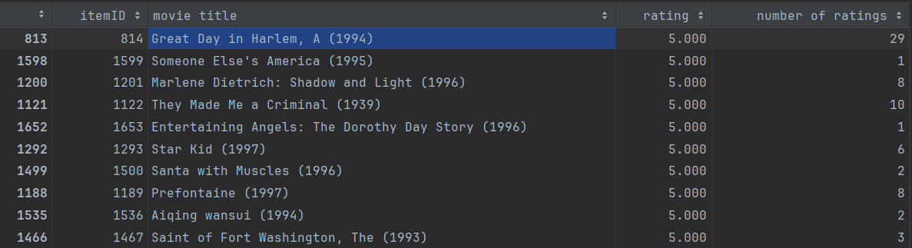
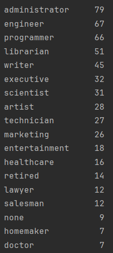
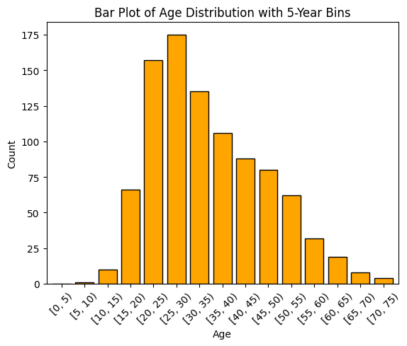
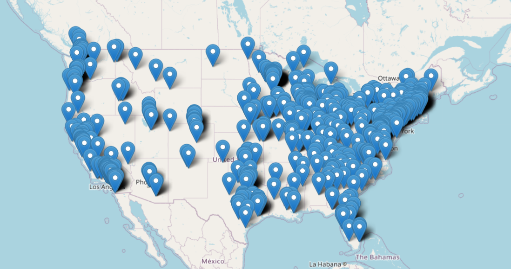

# Introduction

...

# Data analysis

### Overview of the data
During the data overview, I used only `u.data`, `u.item`, `u.user`.
For `u.data` and `u.item` data, I get the films with the highest average rating:

During analyzing `u.user`, I calculate some statistics:
* **Occupation** distribution among the users:

* **Gender** distribution among the users:

| Gender  | Num |
|---------|-----|
| Males   | 670 |
| Females | 273 |

* **Age** distribution among the users:

* And finally **geographic** distribution among the users:

### Data preprocessing

I do all data preprocessing in `movie_cosine_similarity.ipynb`. I use only `u.data` data.

What I do:

1. 

# Model Implementation

...

# Model Advantages and Disadvantages

...

# Training Process

...

# Evaluation

...

# Results

...